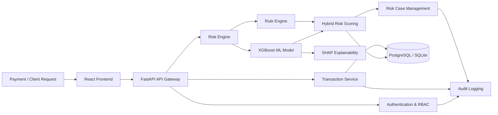
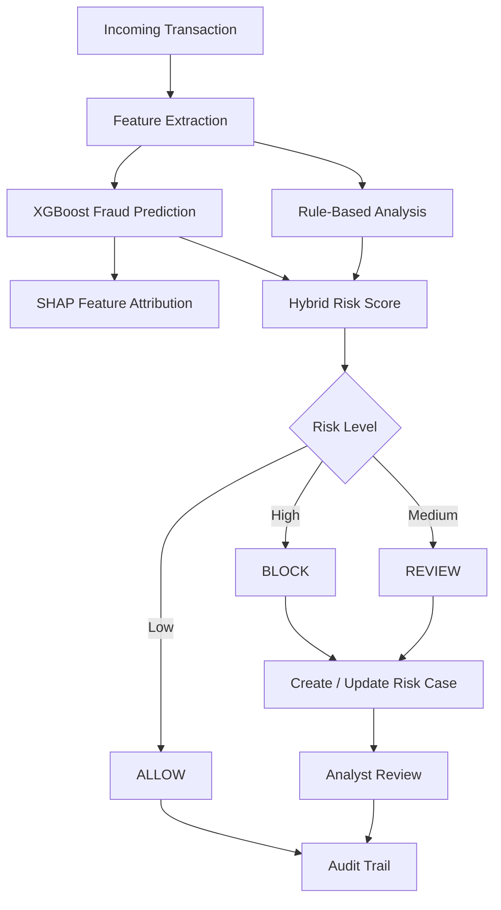
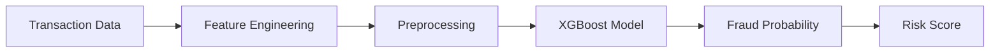
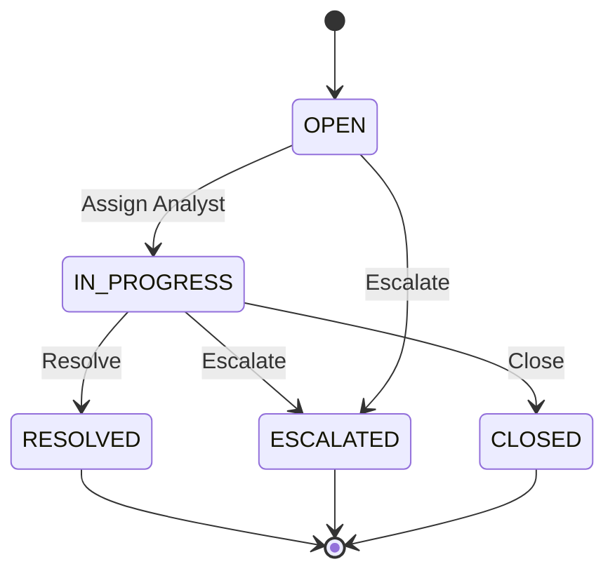
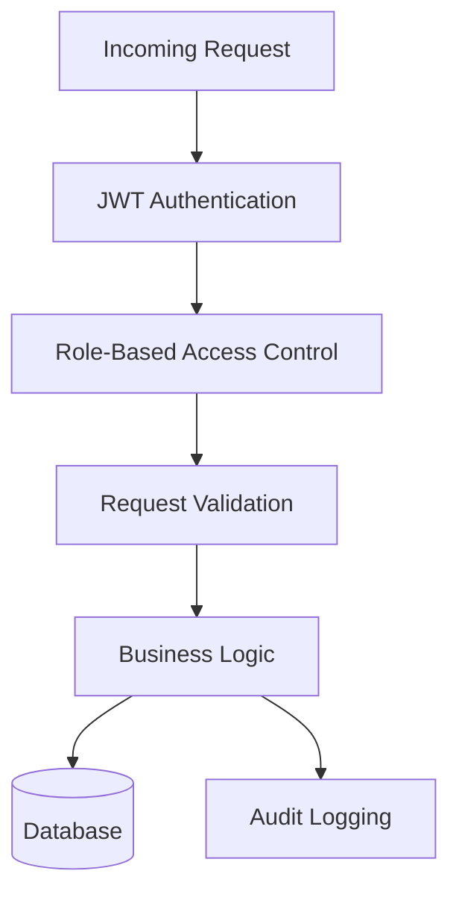

# Riskora — AI-Powered Payment Risk & Fraud Decisioning

> **Intelligent transaction risk assessment for modern payment systems.**

Riskora is a full-stack **AI-powered payment risk and fraud decisioning platform** designed to evaluate transactions, identify suspicious behavior, generate explainable risk scores, and support automated as well as analyst-driven decisions.

The platform combines a **rule-based risk engine**, **XGBoost machine learning**, and **SHAP explainability** to produce a unified risk assessment for every transaction.

Instead of treating fraud detection as a simple binary classification problem, Riskora provides a complete decisioning workflow:

**Transaction → Risk Analysis → Risk Score → Explainability → Decision → Analyst Review → Audit Trail**

---

## ✨ What Riskora Solves

Modern payment systems process a large volume of transactions where fraudulent activity can be difficult to identify using static rules alone.

Riskora addresses this by combining:

* 🧠 **Machine Learning** for fraud probability estimation
* ⚙️ **Rule-Based Detection** for deterministic risk signals
* 📊 **Hybrid Risk Scoring** for balanced decisioning
* 🔍 **SHAP Explainability** to understand model decisions
* 🚦 **Automated Decisioning** — `ALLOW`, `REVIEW`, or `BLOCK`
* 👨‍💻 **Analyst Case Management** for suspicious transactions
* 📝 **Audit Logging** for traceability and compliance-oriented workflows
* 🔐 **JWT Authentication + RBAC** for controlled access

---

## 🎯 Core Concept

Riskora evaluates multiple transaction signals such as:

* Transaction amount
* Transaction velocity
* Device changes
* Location changes
* Merchant risk
* Failed payment attempts
* Account age
* Historical transaction behavior
* ML-generated fraud probability

These signals are processed through the risk engine and converted into a normalized **0–100 risk score**.

### Risk Levels

| Risk Score | Level     | Interpretation                            |
| ---------: | --------- | ----------------------------------------- |
|     `< 30` | 🟢 LOW    | Transaction appears normal                |
|    `30–69` | 🟡 MEDIUM | Transaction requires additional attention |
|     `≥ 70` | 🔴 HIGH   | Strong indicators of potential fraud      |

---

# 🏗️ System Architecture



---

# 🧠 Risk Decisioning Pipeline



---

# ⚖️ Hybrid Risk Scoring

Riskora combines deterministic rules with machine-learning predictions.

```text
Final Risk Score
       │
       ├── 40% Rule-Based Risk
       │
       └── 60% ML Risk
```

The current hybrid scoring strategy is:

```text
final_score = (rules_score × 0.4) + (ml_score × 0.6)
```

Where:

```text
ml_score = fraud_probability × 100
```

This approach allows Riskora to combine:

**Rules → known fraud indicators**

with

**ML → learned transaction patterns**

while retaining explainability through SHAP.

---

# 🚨 Rule-Based Risk Engine

Riskora currently implements multiple deterministic risk signals.

| Rule                       | Trigger                          | Weight |
| -------------------------- | -------------------------------- | -----: |
| `HIGH_AMOUNT`              | Amount > ₹75,000                 |     20 |
| `UNUSUAL_AMOUNT`           | Amount > 5× previous transaction |     25 |
| `HIGH_VELOCITY`            | More than 6 transactions/hour    |     15 |
| `NEW_DEVICE`               | Device changed                   |     15 |
| `LOCATION_CHANGE`          | Location changed                 |     12 |
| `HIGH_MERCHANT_RISK`       | Merchant risk > 61               |     18 |
| `FAILED_ATTEMPTS`          | Failed attempts ≥ 4              |     20 |
| `NEW_ACCOUNT`              | Account age < 30 days            |     10 |
| `MULTIPLE_FAILED_ATTEMPTS` | Failed attempts ≥ 2              |     15 |

All scoring thresholds are centralized through shared risk-engine constants.

---

# 🤖 Machine Learning Layer

Riskora uses **XGBoost** for transaction fraud probability estimation.

### ML Pipeline



The repository includes:

* Feature engineering
* Training configuration
* Model registry
* Model versioning
* Model activation
* Fraud probability prediction
* Hybrid scoring integration

If a trained model is unavailable, the system can fall back to rules-based scoring through the model abstraction.

---

# 🔍 Explainable AI

Riskora is designed to answer not only:

> **"Is this transaction risky?"**

but also:

> **"Why was this transaction considered risky?"**

SHAP is used to provide feature-level attribution for ML predictions.

Example explanation:

```text
Risk Score: 82
Risk Level: HIGH

Primary Signals:
├── Unusual transaction amount
├── New device
├── High transaction velocity
└── Elevated merchant risk
```

This makes the system more useful for analysts because decisions are supported by interpretable signals instead of a black-box prediction alone.

---

# 👨‍💻 Analyst Operations

High-risk transactions can enter an analyst workflow.



Supported analyst actions include:

* `ALLOW`
* `BLOCK`
* `ESCALATE`
* `FLAG`
* `DISMISS`
* `ADD_NOTE`

Each case maintains an action history and audit trail.

---

# 🗂️ Project Structure

```mermaid
flowchart TD

    ROOT["Riskora"]

    ROOT --> BACKEND["backend/"]
    ROOT --> FRONTEND["frontend/"]
    ROOT --> DOCS["docs/"]
    ROOT --> DATA["data/"]
    ROOT --> MLROOT["ml/"]

    %% Backend
    BACKEND --> APP["app/"]

    APP --> API["api/routes/"]
    APP --> CORE["core/"]
    APP --> DB["db/"]
    APP --> MLMOD["ml/"]
    APP --> MODELS["models/"]
    APP --> RISK["risk/"]
    APP --> SCHEMAS["schemas/"]
    APP --> SERVICES["services/"]

    API --> AUTH["auth.py"]
    API --> TRANSACTIONS["transactions.py"]
    API --> RISKROUTES["risk.py"]
    API --> RISKOPS["risk_ops.py"]

    RISK --> RULES["Rules Engine"]
    RISK --> FEATURES["Feature Extraction"]
    RISK --> SCORING["Risk Scoring"]
    RISK --> EXPLAIN["Explainability"]

    MLMOD --> XGB["XGBoost"]
    MLMOD --> TRAIN["Training"]
    MLMOD --> REGISTRY["Model Registry"]
    MLMOD --> SHAP["SHAP"]

    MODELS --> USER["User"]
    MODELS --> TRANSACTION["Transaction"]
    MODELS --> CASE["Risk Case"]
    MODELS --> AUDITMODEL["Audit Log"]

    SERVICES --> TXSERVICE["Transaction Service"]
    SERVICES --> RISKSERVICE["Risk Service"]
    SERVICES --> OPSERVICE["Risk Operations"]
    SERVICES --> AUDITSERVICE["Audit Service"]

    %% Frontend
    FRONTEND --> SRC["src/"]

    SRC --> AUTHFRONT["auth/"]
    SRC --> COMPONENTS["components/"]
    SRC --> SERVICESFRONT["services/"]
    SRC --> VIEWS["views/"]

    VIEWS --> DASH["Dashboard"]
    VIEWS --> TXVIEW["Transactions"]
    VIEWS --> DETAIL["Transaction Detail"]
    VIEWS --> QUEUE["Risk Queue"]
    VIEWS --> ALERTS["Alerts"]
    VIEWS --> LOGIN["Login"]

    %% Docs / Data / ML
    DOCS --> AUDITDOC["Pre-deployment Audit"]

    DATA --> IEEE["IEEE-CIS Dataset"]
    MLROOT --> REPORTS["Reports"]
    MLROOT --> ARTIFACTS["Model Artifacts"]
```



> **Note:** Large IEEE-CIS transaction datasets are intentionally excluded from Git history to keep the repository lightweight and within GitHub file-size limits.

---

# 🧩 Technology Stack

## Frontend

* React 19
* Vite
* JavaScript
* CSS
* API-driven dashboard architecture

## Backend

* Python
* FastAPI
* Uvicorn
* SQLAlchemy 2.0
* Pydantic

## Machine Learning

* XGBoost
* Scikit-learn
* SHAP
* NumPy
* Pandas

## Database

* SQLite for local development
* PostgreSQL for production-oriented deployments

## Security

* JWT authentication
* Role-Based Access Control
* Password hashing
* Protected API routes
* Audit logging
* Environment-based secrets

---

# 🔌 API Overview

### Authentication

| Method | Endpoint                | Description                  |
| ------ | ----------------------- | ---------------------------- |
| `POST` | `/api/v1/auth/register` | Register a user              |
| `POST` | `/api/v1/auth/login`    | Authenticate and receive JWT |
| `GET`  | `/api/v1/auth/me`       | Get current user             |

### Transactions

| Method  | Endpoint                       | Description         |
| ------- | ------------------------------ | ------------------- |
| `GET`   | `/api/v1/transactions`         | List transactions   |
| `POST`  | `/api/v1/transactions`         | Create transaction  |
| `GET`   | `/api/v1/transactions/{id}`    | Transaction details |
| `PATCH` | `/api/v1/transactions/{id}`    | Update transaction  |
| `GET`   | `/api/v1/transactions/summary` | Transaction metrics |

### Risk Intelligence

| Method | Endpoint                            | Description              |
| ------ | ----------------------------------- | ------------------------ |
| `POST` | `/api/v1/risk/analyze/{id}`         | Rule-based analysis      |
| `POST` | `/api/v1/risk/analyze/{id}/ml`      | Hybrid ML analysis       |
| `GET`  | `/api/v1/risk/analyze/{id}/explain` | Explain risk decision    |
| `GET`  | `/api/v1/risk/summary`              | Risk distribution        |
| `GET`  | `/api/v1/risk/trends`               | Risk trends              |
| `GET`  | `/api/v1/risk/recent`               | Recent decisions         |
| `GET`  | `/api/v1/risk/events`               | Risk events              |
| `GET`  | `/api/v1/risk/models`               | Available model versions |

### Analyst Cases

| Method  | Endpoint                     | Description           |
| ------- | ---------------------------- | --------------------- |
| `POST`  | `/api/v1/cases`              | Create risk case      |
| `GET`   | `/api/v1/cases`              | List cases            |
| `GET`   | `/api/v1/cases/queue`        | Analyst review queue  |
| `GET`   | `/api/v1/cases/stats`        | Queue statistics      |
| `GET`   | `/api/v1/cases/{id}`         | Case details          |
| `PATCH` | `/api/v1/cases/{id}`         | Update case           |
| `POST`  | `/api/v1/cases/{id}/assign`  | Assign analyst        |
| `POST`  | `/api/v1/cases/{id}/actions` | Record analyst action |
| `GET`   | `/api/v1/cases/{id}/actions` | Action history        |

---

# 🚀 Getting Started

## Prerequisites

Make sure you have:

* Python 3.11+
* Node.js 18+
* npm
* Git

---

## 1. Clone the Repository

```bash
git clone https://github.com/raghuvanshi-sec/Riskora-AI-Powered-Payment-Risk-Fraud-Decisioning-.git

cd Riskora-AI-Powered-Payment-Risk-Fraud-Decisioning-
```

---

## 2. Backend Setup

```bash
cd backend

python -m venv .venv
```

### Windows

```powershell
.venv\Scripts\activate
```

### Linux / macOS

```bash
source .venv/bin/activate
```

Install dependencies:

```bash
pip install -r requirements.txt
```

Configure environment variables:

```bash
cp ../.env.example .env
```

Start the API:

```bash
uvicorn app.main:app --reload --port 8000
```

Backend:

```text
http://localhost:8000
```

API documentation:

```text
http://localhost:8000/docs
```

---

# 🖥️ Frontend Setup

Open a new terminal:

```bash
cd frontend
npm install
npm run dev
```

Frontend:

```text
http://localhost:5173
```

The frontend communicates with the FastAPI backend through the `/api` routes.

---

# 🤖 Training the ML Model

The hybrid scoring engine requires a trained model for meaningful ML-based predictions.

A model can be trained using the project's training interface:

```python
from app.ml.training import train_model, TrainingConfig

config = TrainingConfig(
    n_estimators=100,
    max_depth=6,
    learning_rate=0.1,
)

model, metrics = train_model(config)

print(metrics)
```

After training, the model can be activated through:

```text
POST /api/v1/risk/models/{version}/activate
```

---

# 🔐 Environment Variables

Create a `.env` file based on `.env.example`.

| Variable                      | Default                 | Purpose                  |
| ----------------------------- | ----------------------- | ------------------------ |
| `SECRET_KEY`                  | Required                | JWT signing key          |
| `ACCESS_TOKEN_EXPIRE_MINUTES` | `60`                    | JWT expiration           |
| `DATABASE_URL`                | SQLite                  | Database connection      |
| `BACKEND_CORS_ORIGINS`        | `http://localhost:5173` | Allowed frontend origins |

### Production Security

Never commit:

```text
.env
API keys
Database credentials
Private keys
Production secrets
```

Use a strong, unique production `SECRET_KEY`.

---

# 🧪 Testing

Backend tests:

```bash
cd backend

python -m pytest tests/ -v
```

Frontend production build:

```bash
cd frontend

npm run build
```

The project includes backend test coverage for core API and risk-management functionality.

---

# 📊 Data Strategy

Riskora's ML experimentation uses transaction-fraud datasets such as the **IEEE-CIS Fraud Detection dataset**.

Large raw datasets are intentionally **not stored inside this Git repository**.

This keeps the repository:

* Lightweight
* GitHub-compatible
* Faster to clone
* Easier to maintain
* Free from unnecessary large binary/data history

For reproducible ML experiments, datasets should be downloaded separately and placed under:

```text
data/
└── ieee_cis/
```

---

# 🛡️ Security Architecture

Riskora implements several security controls:



Security features include:

* JWT Bearer authentication
* Password hashing
* Role-based authorization
* Protected endpoints
* Environment-based secrets
* Audit logging
* Input validation
* Separation between API, service, and data layers

---

# 📈 Product Workflow

Riskora is designed around the workflow of a payment-risk operations team.

```mermaid
Transaction
     │
     ▼
Feature Extraction
     │
     ├───────────────┐
     ▼               ▼
Rules Engine      ML Model
     │               │
     └───────┬───────┘
             ▼
      Hybrid Risk Score
             │
             ▼
       Risk Classification
             │
      ┌──────┼───────┐
      ▼      ▼       ▼
    ALLOW  REVIEW   BLOCK
             │
             ▼
       Risk Case Queue
             │
             ▼
       Analyst Decision
             │
             ▼
        Audit Trail
```

---

# 🗺️ Current Development Status

| Component              | Status                                  |
| ---------------------- | --------------------------------------- |
| React Dashboard        | ✅ Implemented                           |
| FastAPI Backend        | ✅ Implemented                           |
| JWT Authentication     | ✅ Implemented                           |
| RBAC                   | ✅ Implemented                           |
| Transaction Management | ✅ Implemented                           |
| Rule-Based Risk Engine | ✅ Implemented                           |
| XGBoost Integration    | ✅ Implemented                           |
| Hybrid Risk Scoring    | ✅ Implemented                           |
| SHAP Explainability    | ✅ Implemented                           |
| Risk Case Management   | ✅ Implemented                           |
| Analyst Workflow       | ✅ Implemented                           |
| Audit Logging          | ✅ Implemented                           |
| Model Registry         | ✅ Implemented                           |
| Production Deployment  | 🔄 Deployment configuration required    |
| Production ML Training | 🔄 Requires trained production artifact |

---

# 🔭 Future Roadmap

Potential extensions include:

* Real-time payment gateway integration
* Streaming transaction analysis
* Advanced behavioral profiling
* Device fingerprint intelligence
* Graph-based fraud detection
* Adaptive fraud thresholds
* Model drift monitoring
* Automated model retraining
* Advanced anomaly detection
* Production-grade PostgreSQL deployment
* CI/CD and automated security testing
* Payment-provider integrations

---

# 💡 Why Riskora?

Riskora is built around a simple principle:

> **Fraud detection should not only identify risk — it should help teams understand, investigate, and act on that risk.**

By combining deterministic rules, machine learning, explainable AI, and analyst operations into one platform, Riskora moves beyond a simple fraud-classification model toward a complete **payment risk decisioning workflow**.

---

## 📜 License

This project is intended for educational, research, portfolio, and demonstration purposes.

See the repository license for applicable usage terms.

---

## 👨‍💻 Author

**Satyam Raghuvanshi**

Full-Stack Developer • AI/ML • FinTech • Cybersecurity

---

<p align="center">
  <b>Riskora</b><br>
  AI-Powered Payment Risk & Fraud Decisioning
</p>
